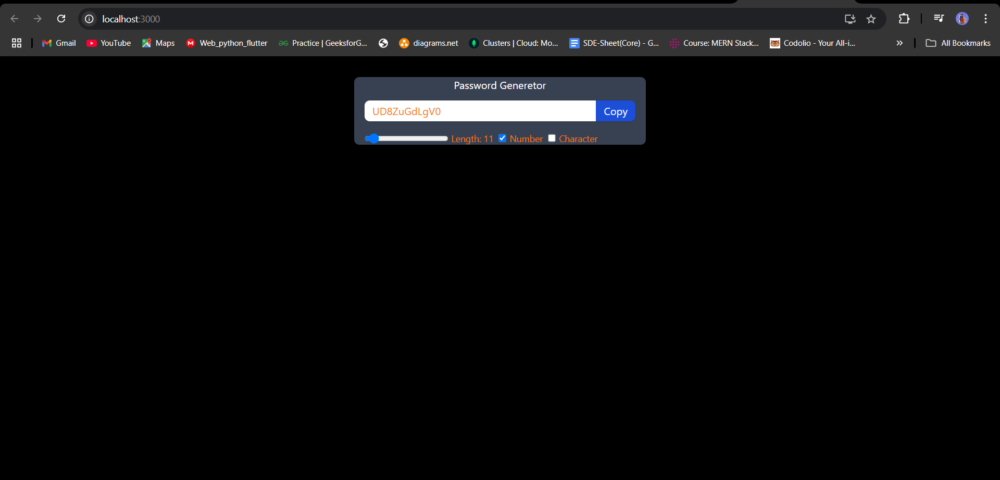

# Password Generator

A **Password Generator** application built using React. This tool allows users to generate secure passwords with customizable options, including the ability to adjust password length and include numbers or special characters. Users can also easily copy the generated password to their clipboard.

## Features

- **Dynamic Password Length**: Adjust password length between 6 and 100 characters using a slider.
- **Include Numbers**: Option to include numeric characters in the password.
- **Include Special Characters**: Option to include special characters (!@#$%^&*()).
- **Clipboard Copy**: One-click button to copy the generated password to your clipboard.
- **Real-Time Updates**: Password updates dynamically as you change the options.

## Demo


## Technologies Used

- **Frontend**: React
- **Styling**: TailwindCSS

## Getting Started

Follow the steps below to run this project locally.

### Prerequisites

- Node.js and npm installed on your machine.
- A code editor like VS Code.

### Installation

1. **Clone the Repository**:
   ```bash
   git clone <repository_url>
   cd password-generator
   ```

2. **Install Dependencies**:
   ```bash
   npm install
   ```

3. **Run the Application**:
   ```bash
   npm start
   ```

4. Open your browser and navigate to `http://localhost:3000`.

## File Structure

```
password-generator/
├── src/
│   ├── App.js          # Main application file
│   ├── index.js        # Entry point
│   └── styles.css      # Styling for the application
├── public/
│   ├── index.html      # HTML template
│   └── ...
├── package.json        # Project configuration
└── README.md           # Project documentation
```

## Usage

1. **Adjust Length**: Use the slider to set the desired password length.
2. **Include Numbers**: Check the box to include numeric characters in the password.
3. **Include Special Characters**: Check the box to include special characters (!@#$%^&*()).
4. **Copy Password**: Click the "Copy" button to copy the generated password to your clipboard.


## Contributing

Contributions are welcome! If you have suggestions for improvements or find any bugs, please open an issue or submit a pull request.

## License

This project is licensed under the MIT License. See the `LICENSE` file for details.

## Contact

If you have any questions or feedback, feel free to contact:
- **Email**: [sagarsaksham007@gmail.com](mailto:sagarsaksham007@gmail.com)

---

Enjoy using the Password Generator!
